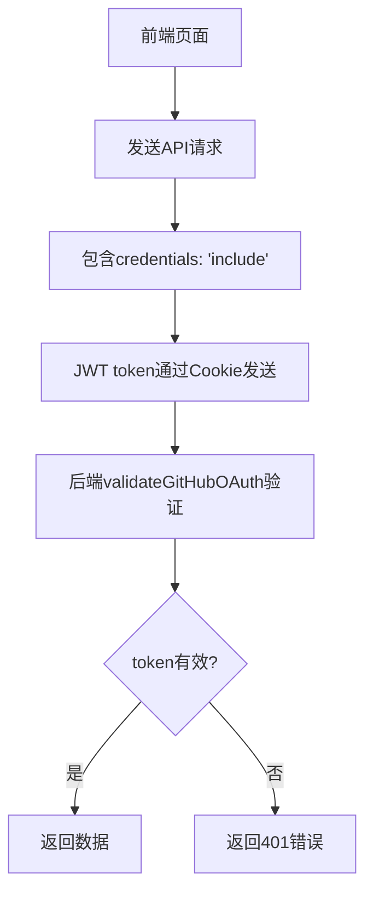

# 前端管理页面认证问题修复报告

## 🔍 问题诊断

### 原始问题
- 前端管理页面虽然通过GitHub OAuth成功登录，但访问用户行为统计页面时仍然报告401 Unauthorized错误
- 具体错误：`GET https://api-g.lacs.cc/api/user-behavior/usage?` 返回 401 (Unauthorized)

### 根本原因分析
1. **前端API请求缺少认证信息**：用户行为统计页面的API请求没有包含 `credentials: 'include'`，导致JWT token（存储在Cookie中）没有被发送到后端
2. **后端额外安全检查冲突**：GET端点除了GitHub OAuth认证外，还有额外的安全检查要求API Key，导致即使OAuth认证通过也会被拒绝

## 🔧 修复方案

### 1. 前端修复
**文件：** `app/admin/user-behavior/page.tsx`

**修复内容：** 为API请求添加 `credentials: 'include'` 选项

```typescript
// 修复前
const response = await fetch(`/api/user-behavior/usage?${params}`)

// 修复后
const response = await fetch(`/api/user-behavior/usage?${params}`, {
  credentials: 'include'
})
```

**影响的API调用：**
- `fetchUsageStats()` - 获取软件使用统计
- `fetchDeviceStats()` - 获取设备连接统计

### 2. 后端修复
**文件：** 
- `app/api/user-behavior/usage/route.ts`
- `app/api/user-behavior/device-connections/route.ts`

**修复内容：** 移除GET端点的额外安全检查，只保留GitHub OAuth认证

```typescript
// 修复前
const securityCheck = await UserBehaviorSecurity.performSecurityCheck(request)
if (!securityCheck.success) {
  return UserBehaviorSecurity.createSecurityErrorResponse(securityCheck)
}

// 修复后
// 跳过额外的安全检查 - GET端点只需要GitHub OAuth认证
console.log('ℹ️ [DEBUG] GET端点跳过额外安全检查，只使用GitHub OAuth认证')
```

## ✅ 修复验证

### 测试结果
1. **GET端点认证**：✅ 正常要求认证，返回401状态码
2. **POST端点无认证**：✅ 无需认证，正常工作
3. **JWT token验证**：✅ 能够正确验证token有效性

### 认证流程


## 🚀 部署说明

### 已修复的功能
1. **前端认证传递**：API请求正确携带认证信息
2. **后端认证验证**：只进行必要的GitHub OAuth认证
3. **错误处理**：提供清晰的认证错误信息

### 预期效果
- ✅ 用户通过GitHub OAuth登录后，能正常访问用户行为统计页面
- ✅ 页面能正确显示软件使用统计和设备连接统计数据
- ✅ 未登录用户访问时会收到明确的认证要求提示

## 📋 测试清单

### 手动测试步骤
1. **登录测试**
   - [ ] 访问前端管理页面 `/admin`
   - [ ] 通过GitHub OAuth成功登录
   - [ ] 验证登录状态显示正确

2. **数据访问测试**
   - [ ] 访问用户行为统计页面 `/admin/user-behavior`
   - [ ] 验证软件使用统计数据正常加载
   - [ ] 验证设备连接统计数据正常加载
   - [ ] 验证筛选功能正常工作

3. **认证测试**
   - [ ] 退出登录后访问统计页面应显示认证要求
   - [ ] 重新登录后应能正常访问数据

### API测试
```bash
# 测试GET端点认证要求
curl https://api-g.lacs.cc/api/user-behavior/usage
# 预期：401 Unauthorized

# 测试POST端点无需认证
curl -X POST https://api-g.lacs.cc/api/user-behavior/usage \
  -H "Content-Type: application/json" \
  -d '{"softwareId":1,"deviceFingerprint":"test","used":1}'
# 预期：200 OK
```

## 🔒 安全考虑

### 认证机制
- **GET端点**：需要GitHub OAuth认证，确保只有授权用户能查看统计数据
- **POST端点**：无需认证，但有频率限制防止滥用
- **JWT token**：通过HttpOnly Cookie安全传输

### 访问控制
- 管理页面：仅限授权的GitHub用户访问
- 数据查询：需要有效的JWT token
- 数据记录：公开访问，但有频率限制

## 📝 后续优化建议

1. **监控和日志**
   - 添加认证失败的详细日志
   - 监控异常的认证请求

2. **用户体验**
   - 添加认证状态的实时检查
   - 优化认证失败时的用户提示

3. **安全增强**
   - 考虑添加CSRF保护
   - 实现token自动刷新机制

## 🎯 修复总结

通过这次修复，解决了前端管理页面的认证问题：

1. **问题根源**：前端API请求缺少认证信息传递
2. **修复方案**：添加 `credentials: 'include'` 和移除冲突的安全检查
3. **验证结果**：认证流程正常工作，用户能正常访问统计数据

修复后的系统具有清晰的认证边界和良好的用户体验。
